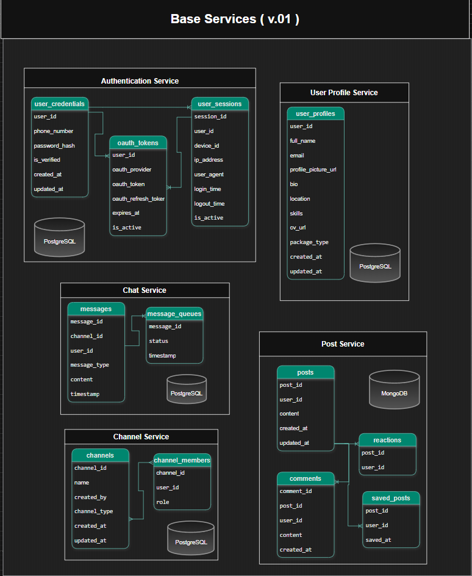
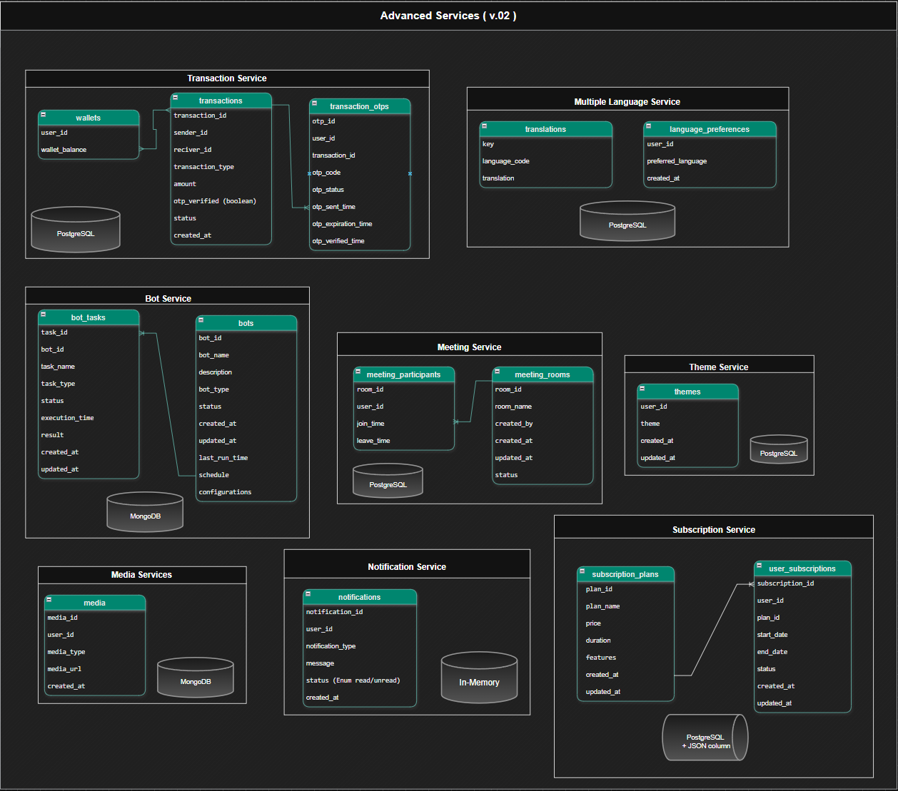
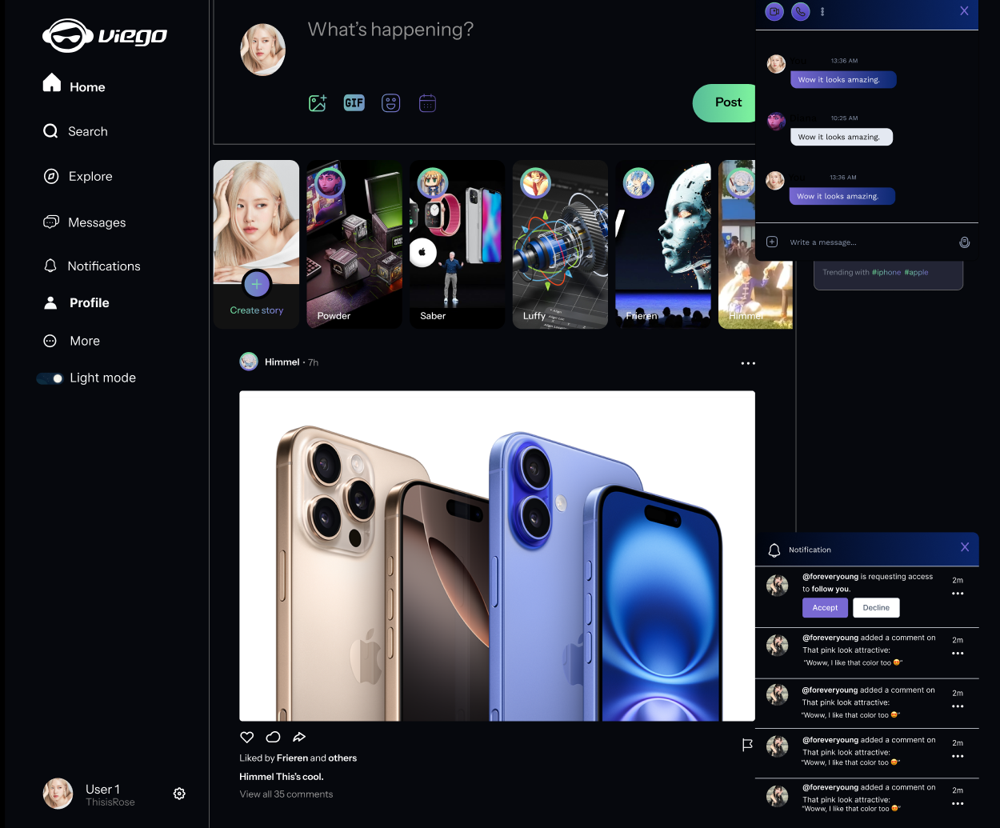
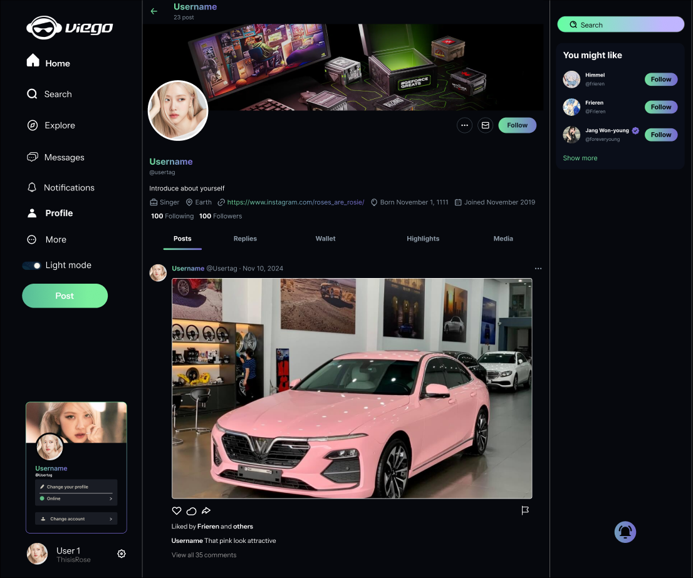
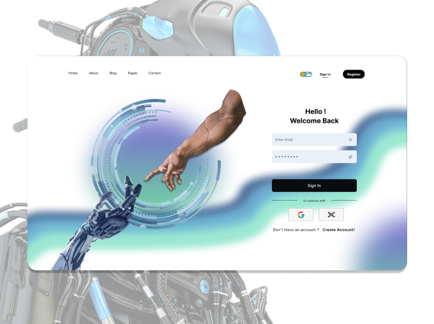

# VieNext - Social Network Platform with Integrated Features

## Software Requirement Document

**Hồ Chí Minh, April 2025**

---

## Table of Contents

- [Record of Changes](#record-of-changes) ............................................................. 
- [I. Introduction](#i-introduction) .................................................................... 
- [II. Overall Description](#ii-overall-description) ................................................ 
  - [1. System Overview](#1-system-overview) .............................................. 
  - [2. Technology Stack](#2-technology-stack) ............................................ 
  - [3. System Architecture](#3-system-architecture) ..................................... 
  - [4. Database Design](#4-database-design) .............................................. 
- [III. User Requirements](#iii-user-requirements) ................................................. 
  - [1. Actor](#1-actor) ....................................................................... 
  - [2. Use Case](#2-use-case) ................................................................ 
    - [2.1. Use Case Overview](#21-use-case-overview) .............................. 
    - [2.2. Use Case Diagram](#22-use-case-diagram) ................................. 
    - [2.3. Use Case Descriptions](#23-use-case-descriptions) .................. 
  - [3. Business Rules](#3-business-rules) .............................................. 
- [IV. Functional Requirements](#iv-functional-requirements) .................................. 
- [V. Non-Functional Requirements](#v-non-functional-requirements) ...................... 
  - [1. External Interfaces](#1-external-interfaces) ....................................... 
    - [1.1. User Interfaces](#11-user-interfaces) ...................................... 
    - [1.2. Software Interfaces](#12-software-interfaces) ............................ 
    - [1.3. Hardware Interfaces](#13-hardware-interfaces) ............................ 
    - [1.4. Communications Interfaces](#14-communications-interfaces) ............ 
  - [2. Quality Attributes](#2-quality-attributes) ......................................... 
    - [2.1. Usability](#21-usability) ..................................................... 
    - [2.2. Performance](#22-performance) ............................................... 
    - [2.3. Security](#23-security) ...................................................... 
    - [2.4. Safety](#24-safety) .......................................................... 
    - [2.5. Availability](#25-availability) ............................................ 
    - [2.6. Reliability](#26-reliability) ............................................... 
    - [2.7. Others as Relevant](#27-others-as-relevant) ............................. 

---

## RECORD OF CHANGES

<table style="border-collapse: collapse; width: 100%;">
  <tr style="background-color:rgb(147, 214, 153);">
    <th style="border: 1px solid black; padding: 8px;">Date</th>
    <th style="border: 1px solid black; padding: 8px;">*A, M, D</th>
    <th style="border: 1px solid black; padding: 8px;">Change Description</th>
  </tr>
  <tr>
    <td style="border: 1px solid black; padding: 8px;">12/04/2025</td>
    <td style="border: 1px solid black; padding: 8px;">A</td>
    <td style="border: 1px solid black; padding: 8px;">Initial draft of the Software Requirement Document</td>
  </tr>
</table>

*A - Added, M - Modified, D - Deleted*

---

## I. INTRODUCTION

The Social Network Platform with Integrated Features is a versatile online platform designed to go beyond traditional social networking. It not only provides basic features like posting, interacting, and messaging but also includes tools for collaboration (online meetings), reputation assessment, and financial transactions. The system is divided into two versions:
- **v0.1**: Focuses on core social networking features.
- **v0.2**: Adds advanced features like online meetings, smart bots, reputation checks, and a wallet system, with premium options requiring payment.

**Objective**: To create a multi-functional platform where users can connect, collaborate, verify each other’s reliability, and perform secure transactions.

**Author**: ***[`BinhPV96`](https://binhpv96.is-a.dev/)*** ( Click to visit my portfolio website )

---

## II. OVERALL DESCRIPTION

### 1. System Overview

The Social Network Platform operates as a web-based application with a client-server architecture. It aims to provide a seamless user experience by integrating social networking with productivity and financial tools. Key features include real-time messaging, online meetings, reputation verification, and a wallet system for transactions.

### 2. Technology Stack

- **Backend**: `Spring Boot` ( microservices ), `MongoDB`, `OAuth 2.0`, `Spring WebSocket`, `Redis`, `RESTful API`.
- **Frontend**: `Next.js` ( deployed on Vercel ), `WebRTC` ( for online meetings ).
- **Bot and AI**: 
- **Payment**: 
- **DevOps**: `GitHub`, `Docker`, `Google GCP`, `Vercel`, `Swagger`.
- **UI Library**: `Mantine`, `Chakra UI` and `Material-UI` 

### 3. System Architecture

The system uses a microservices architecture to ensure scalability and maintainability. Key components include:
- **Microservices**: User, Post, Chat, Meeting, Bot, Reputation, Payment.
- **Database**: `MongoDB` ( NoSQL ).
- **Cache**: `Redis`.
- **API Gateway**:

*Figure 1: System Architecture Diagram*

### 4. Database Design

Data is stored in MongoDB with the following main collections:
- `users`: Stores user information (ID, username, email, premium status).
- `posts`: Stores posts (ID, content, userID, likes).
- `transactions`: Stores transaction records (ID, userID, amount, timestamp).

*Figure 2, 3: Database Schema*
- You can visit **[`Link ERD`](https://drive.google.com/file/d/1PNq_fepyitkTRNCZXXyOY4_MJ44djzNg/view?usp=sharing)** to view the full ERD.

---

## III. USER REQUIREMENTS
### 1. Actor

<table style="border-collapse: collapse; width: 100%;">
  <tr style="background-color: rgb(147, 214, 153);">
    <th style="border: 1px solid black; padding: 8px;"></th>
    <th style="border: 1px solid black; padding: 8px;">Actor</th>
    <th style="border: 1px solid black; padding: 8px;">Description</th>
  </tr>
  <tr>
    <td style="border: 1px solid black; padding: 8px;">1</td>
    <td style="border: 1px solid black; padding: 8px;">Admin</td>
    <td style="border: 1px solid black; padding: 8px;"></td>
  </tr>
  <tr>
    <td style="border: 1px solid black; padding: 8px;">2</td>
    <td style="border: 1px solid black; padding: 8px;">Free User</td>
    <td style="border: 1px solid black; padding: 8px;">A free user who can access basic social networking features such as creating and joining online meetings (video calls, screen sharing),  posting, commenting, liking, sharing, and real-time messaging. Free Users can join public channels/groups and upgrade to Premium Users to access advanced features.</td>
  </tr>
  <tr>
    <td style="border: 1px solid black; padding: 8px;">3</td>
    <td style="border: 1px solid black; padding: 8px;">Premium User</td>
    <td style="border: 1px solid black; padding: 8px;">A paid user who has access to all Free User features, plus advanced features such as using chat bots, checking other users' reputation, performing monetary transactions (transferring money, finding collaborators), and receiving priority support.</td>
  </tr>
  <tr>
    <td style="border: 1px solid black; padding: 8px;">4</td>
    <td style="border: 1px solid black; padding: 8px;">Guest</td>
    <td style="border: 1px solid black; padding: 8px;">An unregistered visitor who can view public posts and basic user information (public profiles). Guests cannot interact (comment, like, message) or access advanced features. They can register to become Free Users or Premium Users.</td>
  </tr>
  <tr>
    <td style="border: 1px solid black; padding: 8px;">5</td>
    <td style="border: 1px solid black; padding: 8px;">Bot</td>
    <td style="border: 1px solid black; padding: 8px;">An automated bot system, introduced in version v.02, responsible for tasks such as spam prevention (detecting and removing inappropriate messages), auto-posting content on a schedule, and providing content recommendations based on user behavior. The Bot operates within channels/groups and supports both Free Users and Premium Users.</td>
  </tr>
  <tr>
    <td style="border: 1px solid black; padding: 8px;">6</td>
    <td style="border: 1px solid black; padding: 8px;">Third-Party Payment System</td>
    <td style="border: 1px solid black; padding: 8px;">An external payment system (e.g., Stripe, PayPal) integrated into the platform to handle financial transactions. It processes payments for wallet top-ups, premium subscriptions, and monetary transactions between users (e.g., transferring money, paying for services). The system ensures secure and reliable payment processing.</td>
  </tr>
</table>

### 2. Use Case

#### 2.1 Use Case Overview

<table style="border-collapse: collapse; width: 100%;">
  <tr style="background-color: rgb(147, 214, 153);">
    <th style="border: 1px solid black; padding: 8px;">ID</th>
    <th style="border: 1px solid black; padding: 8px;">Use Case</th>
    <th style="border: 1px solid black; padding: 8px;">Actors</th>
    <th style="border: 1px solid black; padding: 8px;">Description</th>
  </tr>
  <tr>
    <td style="border: 1px solid black; padding: 8px;">UC-01</td>
    <td style="border: 1px solid black; padding: 8px;">Register Account</td>
    <td style="border: 1px solid black; padding: 8px;">Guest</td>
    <td style="border: 1px solid black; padding: 8px;">Guests can register to become Free Users by providing username, email, and password or by thirt-part app.</td>
  </tr>
  <tr>
    <td style="border: 1px solid black; padding: 8px;">UC-02</td>
    <td style="border: 1px solid black; padding: 8px;">Login to Account</td>
    <td style="border: 1px solid black; padding: 8px;">Free User, Premium User</td>
    <td style="border: 1px solid black; padding: 8px;">Users can log in to their account using email/username and password or by thirt-part app.</td>
  </tr>
  <tr>
    <td style="border: 1px solid black; padding: 8px;">UC-03</td>
    <td style="border: 1px solid black; padding: 8px;">Upgrade to Premium</td>
    <td style="border: 1px solid black; padding: 8px;">Free User, Third-Party Payment System</td>
    <td style="border: 1px solid black; padding: 8px;">Free Users can upgrade to Premium to access advanced features by making a payment through a third-party payment system.</td>
  </tr>
  <tr>
    <td style="border: 1px solid black; padding: 8px;">UC-04</td>
    <td style="border: 1px solid black; padding: 8px;">Create Post</td>
    <td style="border: 1px solid black; padding: 8px;">Free User, Premium User</td>
    <td style="border: 1px solid black; padding: 8px;">Users can create and share posts on the social network.</td>
  </tr>
  <tr>
    <td style="border: 1px solid black; padding: 8px;">UC-05</td>
    <td style="border: 1px solid black; padding: 8px;">Interact with Post</td>
    <td style="border: 1px solid black; padding: 8px;">Free User, Premium User</td>
    <td style="border: 1px solid black; padding: 8px;">Users can interact with posts by commenting, liking, or sharing them.</td>
  </tr>
  <tr>
    <td style="border: 1px solid black; padding: 8px;">UC-06</td>
    <td style="border: 1px solid black; padding: 8px;">Create Channel/Group</td>
    <td style="border: 1px solid black; padding: 8px;">Free User, Premium User</td>
    <td style="border: 1px solid black; padding: 8px;">Users can create channels or groups and manage permissions for members.</td>
  </tr>
  <tr>
    <td style="border: 1px solid black; padding: 8px;">UC-07</td>
    <td style="border: 1px solid black; padding: 8px;">Join Channel/Group</td>
    <td style="border: 1px solid black; padding: 8px;">Free User, Premium User</td>
    <td style="border: 1px solid black; padding: 8px;">Users can join public channels/groups or request to join private ones.</td>
  </tr>
  <tr>
    <td style="border: 1px solid black; padding: 8px;">UC-08</td>
    <td style="border: 1px solid black; padding: 8px;">Create Online Meeting</td>
    <td style="border: 1px solid black; padding: 8px;">Premium User</td>
    <td style="border: 1px solid black; padding: 8px;">Premium Users can create and schedule online meetings with video call and screen-sharing capabilities.</td>
  </tr>
  <tr>
    <td style="border: 1px solid black; padding: 8px;">UC-09</td>
    <td style="border: 1px solid black; padding: 8px;">Join Online Meeting</td>
    <td style="border: 1px solid black; padding: 8px;">User</td>
    <td style="border: 1px solid black; padding: 8px;">Users can join scheduled online meetings.</td>
  </tr>
  <tr>
    <td style="border: 1px solid black; padding: 8px;">UC-10</td>
    <td style="border: 1px solid black; padding: 8px;">Use Chat Bot</td>
    <td style="border: 1px solid black; padding: 8px;">Premium User, Bot</td>
    <td style="border: 1px solid black; padding: 8px;">Premium Users can interact with the bot for spam prevention, auto-posting, and content recommendations.</td>
  </tr>
  <tr>
    <td style="border: 1px solid black; padding: 8px;">UC-11</td>
    <td style="border: 1px solid black; padding: 8px;">Check User Reputation</td>
    <td style="border: 1px solid black; padding: 8px;">Premium User</td>
    <td style="border: 1px solid black; padding: 8px;">Premium Users can check the reputation score of other users based on their transaction history and feedback.</td>
  </tr>
  <tr>
    <td style="border: 1px solid black; padding: 8px;">UC-12</td>
    <td style="border: 1px solid black; padding: 8px;">Top Up Wallet</td>
    <td style="border: 1px solid black; padding: 8px;">Free User, Premium User, Third-Party Payment System</td>
    <td style="border: 1px solid black; padding: 8px;">Users can top up their wallet balance to use for premium subscriptions or transactions.</td>
  </tr>
  <tr>
    <td style="border: 1px solid black; padding: 8px;">UC-13</td>
    <td style="border: 1px solid black; padding: 8px;">Perform Transaction</td>
    <td style="border: 1px solid black; padding: 8px;">Premium User, Third-Party Payment System</td>
    <td style="border: 1px solid black; padding: 8px;">Premium Users can transfer money to other users or pay for services within the platform.</td>
  </tr>
  <tr>
    <td style="border: 1px solid black; padding: 8px;">UC-14</td>
    <td style="border: 1px solid black; padding: 8px;">Receive Notifications</td>
    <td style="border: 1px solid black; padding: 8px;">Free User, Premium User</td>
    <td style="border: 1px solid black; padding: 8px;">Users receive notifications about posts, messages, meetings, transactions, and recommendations.</td>
  </tr>
  <tr>
    <td style="border: 1px solid black; padding: 8px;">UC-15</td>
    <td style="border: 1px solid black; padding: 8px;">Manage Users</td>
    <td style="border: 1px solid black; padding: 8px;">Admin</td>
    <td style="border: 1px solid black; padding: 8px;">Admin can manage user accounts (create, edit, delete) and monitor user activities.</td>
  </tr>
</table>

#### 2.2 Use Case Diagram

*Figure 3: Use Case Diagram*

#### 2.3 Use Case Descriptions

<table style="border-collapse: collapse; width: 100%;">
  <tr style="background-color: rgb(147, 214, 153);">
    <th style="border: 1px solid black; padding: 8px;">Field</th>
    <th style="border: 1px solid black; padding: 8px;">Description</th>
  </tr>
  <tr>
    <td style="border: 1px solid black; padding: 8px;">ID</td>
    <td style="border: 1px solid black; padding: 8px;">UC-01: Register Account</td>
  </tr>
   
  <tr>
    <td style="border: 1px solid black; padding: 8px;">Date Created</td>
    <td style="border: 1px solid black; padding: 8px;">12/04/2025</td>
  </tr>
  <tr>
    <td style="border: 1px solid black; padding: 8px;">Primary Actor</td>
    <td style="border: 1px solid black; padding: 8px;">Guest</td>
  </tr>
  <tr>
    <td style="border: 1px solid black; padding: 8px;">Secondary Actors</td>
    <td style="border: 1px solid black; padding: 8px;">None</td>
  </tr>
  <tr>
    <td style="border: 1px solid black; padding: 8px;">Description</td>
    <td style="border: 1px solid black; padding: 8px;">Guests can register to become Free Users by providing username, email, and password or continue with thirt-part app.</td>
  </tr>
  <tr>
    <td style="border: 1px solid black; padding: 8px;">Trigger</td>
    <td style="border: 1px solid black; padding: 8px;">Guest selects "Register" on the website.</td>
  </tr>
  <tr>
    <td style="border: 1px solid black; padding: 8px;">Preconditions</td>
    <td style="border: 1px solid black; padding: 8px;">Guest is not logged in and does not have an account.</td>
  </tr>
  <tr>
    <td style="border: 1px solid black; padding: 8px;">Postconditions</td>
    <td style="border: 1px solid black; padding: 8px;">Guest becomes a Free User with a new account and can log in.</td>
  </tr>
  <tr>
    <td style="border: 1px solid black; padding: 8px;">Normal Flow</td>
    <td style="border: 1px solid black; padding: 8px;">
      1. Guest selects "Register" and fills in username, email, and password. 
      2. System validates the input (e.g., email not already in use). 
      3. System creates a new Free User account and notifies the user via email.
    </td>
  </tr>
  <tr>
    <td style="border: 1px solid black; padding: 8px;">Exceptions</td>
    <td style="border: 1px solid black; padding: 8px;">
      1. <b>Email Already Exists</b>: System informs the user to use a different email. 
      2. <b>Invalid Input</b>: System informs the user to correct the input (e.g., password too short).
    </td>
  </tr>
  <tr>
    <td style="border: 1px solid black; padding: 8px;">Priority</td>
    <td style="border: 1px solid black; padding: 8px;">High</td>
  </tr>
  <tr>
    <td style="border: 1px solid black; padding: 8px;">Frequency</td>
    <td style="border: 1px solid black; padding: 8px;">As needed</td>
  </tr>
  <tr>
    <td style="border: 1px solid black; padding: 8px;">Business Rules</td>
    <td style="border: 1px solid black; padding: 8px;">BR-01: Password must be at least 8 characters long and contain at least one uppercase letter, one number, and one special character.</td>
  </tr>
</table>

<table style="border-collapse: collapse; width: 100%;">
  <tr style="background-color: rgb(147, 214, 153);">
    <th style="border: 1px solid black; padding: 8px;">Field</th>
    <th style="border: 1px solid black; padding: 8px;">Description</th>
  </tr>
  <tr>
    <td style="border: 1px solid black; padding: 8px;">ID</td>
    <td style="border: 1px solid black; padding: 8px;">UC-02: Login to Account</td>
  </tr>
   
  <tr>
    <td style="border: 1px solid black; padding: 8px;">Date Created</td>
    <td style="border: 1px solid black; padding: 8px;">12/04/2025</td>
  </tr>
  <tr>
    <td style="border: 1px solid black; padding: 8px;">Primary Actor</td>
    <td style="border: 1px solid black; padding: 8px;">Free User, Premium User</td>
  </tr>
  <tr>
    <td style="border: 1px solid black; padding: 8px;">Secondary Actors</td>
    <td style="border: 1px solid black; padding: 8px;">None</td>
  </tr>
  <tr>
    <td style="border: 1px solid black; padding: 8px;">Description</td>
    <td style="border: 1px solid black; padding: 8px;">Users can log in to their account using email/username and password or continue with thirt-part app.</td>
  </tr>
  <tr>
    <td style="border: 1px solid black; padding: 8px;">Trigger</td>
    <td style="border: 1px solid black; padding: 8px;">User selects "Login" on the website.</td>
  </tr>
  <tr>
    <td style="border: 1px solid black; padding: 8px;">Preconditions</td>
    <td style="border: 1px solid black; padding: 8px;">User has a registered account and is not logged in.</td>
  </tr>
  <tr>
    <td style="border: 1px solid black; padding: 8px;">Postconditions</td>
    <td style="border: 1px solid black; padding: 8px;">User is logged in and can access their account features.</td>
  </tr>
  <tr>
    <td style="border: 1px solid black; padding: 8px;">Normal Flow</td>
    <td style="border: 1px solid black; padding: 8px;">
      1. User selects "Login" and enters email/username and password. 
      2. System validates the credentials. 
      3. System logs the user in and redirects to the homepage.
    </td>
  </tr>
  <tr>
    <td style="border: 1px solid black; padding: 8px;">Exceptions</td>
    <td style="border: 1px solid black; padding: 8px;">
      1. <b>Incorrect Credentials</b>: System informs the user that the email/username or password is incorrect. 
      2. <b>Account Locked</b>: System informs the user that their account is locked due to multiple failed attempts.
    </td>
  </tr>
  <tr>
    <td style="border: 1px solid black; padding: 8px;">Priority</td>
    <td style="border: 1px solid black; padding: 8px;">High</td>
  </tr>
  <tr>
    <td style="border: 1px solid black; padding: 8px;">Frequency</td>
    <td style="border: 1px solid black; padding: 8px;">Frequent</td>
  </tr>
  <tr>
    <td style="border: 1px solid black; padding: 8px;">Business Rules</td>
    <td style="border: 1px solid black; padding: 8px;">BR-02: After 5 failed login attempts, the account is temporarily locked for 15 minutes.</td>
  </tr>
</table>
<table style="border-collapse: collapse; width: 100%;">
  <tr style="background-color: rgb(147, 214, 153);">
    <th style="border: 1px solid black; padding: 8px;">Field</th>
    <th style="border: 1px solid black; padding: 8px;">Description</th>
  </tr>
  <tr>
    <td style="border: 1px solid black; padding: 8px;">ID</td>
    <td style="border: 1px solid black; padding: 8px;">UC-03: Upgrade to Premium</td>
  </tr>
   
  <tr>
    <td style="border: 1px solid black; padding: 8px;">Date Created</td>
    <td style="border: 1px solid black; padding: 8px;">12/04/2025</td>
  </tr>
  <tr>
    <td style="border: 1px solid black; padding: 8px;">Primary Actor</td>
    <td style="border: 1px solid black; padding: 8px;">Free User</td>
  </tr>
  <tr>
    <td style="border: 1px solid black; padding: 8px;">Secondary Actors</td>
    <td style="border: 1px solid black; padding: 8px;">Third-Party Payment System</td>
  </tr>
  <tr>
    <td style="border: 1px solid black; padding: 8px;">Description</td>
    <td style="border: 1px solid black; padding: 8px;">Free Users can upgrade to Premium to access advanced features by making a payment through a third-party payment system.</td>
  </tr>
  <tr>
    <td style="border: 1px solid black; padding: 8px;">Trigger</td>
    <td style="border: 1px solid black; padding: 8px;">Free User selects "Upgrade to Premium" in their account settings.</td>
  </tr>
  <tr>
    <td style="border: 1px solid black; padding: 8px;">Preconditions</td>
    <td style="border: 1px solid black; padding: 8px;">User is logged in as a Free User and has a valid payment method.</td>
  </tr>
  <tr>
    <td style="border: 1px solid black; padding: 8px;">Postconditions</td>
    <td style="border: 1px solid black; padding: 8px;">User becomes a Premium User with access to advanced features.</td>
  </tr>
  <tr>
    <td style="border: 1px solid black; padding: 8px;">Normal Flow</td>
    <td style="border: 1px solid black; padding: 8px;">
      1. Free User selects "Upgrade to Premium" and chooses a subscription plan. 
      2. System redirects the user to the third-party payment system to complete the payment. 
      3. Third-Party Payment System processes the payment and notifies the system. 
      4. System updates the user's account to Premium status and notifies the user.
    </td>
  </tr>
  <tr>
    <td style="border: 1px solid black; padding: 8px;">Exceptions</td>
    <td style="border: 1px solid black; padding: 8px;">
      1. <b>Payment Failure</b>: Third-Party Payment System fails to process the payment, and the system informs the user to try again. 
      2. <b>Insufficient Funds</b>: Third-Party Payment System rejects the transaction due to insufficient funds, and the system informs the user.
    </td>
  </tr>
  <tr>
    <td style="border: 1px solid black; padding: 8px;">Priority</td>
    <td style="border: 1px solid black; padding: 8px;">High</td>
  </tr>
  <tr>
    <td style="border: 1px solid black; padding: 8px;">Frequency</td>
    <td style="border: 1px solid black; padding: 8px;">As needed</td>
  </tr>
  <tr>
    <td style="border: 1px solid black; padding: 8px;">Business Rules</td>
    <td style="border: 1px solid black; padding: 8px;">BR-03: Premium subscription plans must be predefined with pricing and duration (e.g., monthly, yearly).</td>
  </tr>
</table>

<table style="border-collapse: collapse; width: 100%;">
  <tr style="background-color: rgb(147, 214, 153);">
    <th style="border: 1px solid black; padding: 8px;">Field</th>
    <th style="border: 1px solid black; padding: 8px;">Description</th>
  </tr>
  <tr>
    <td style="border: 1px solid black; padding: 8px;">ID</td>
    <td style="border: 1px solid black; padding: 8px;">UC-04: Create Post</td>
  </tr>
   
  <tr>
    <td style="border: 1px solid black; padding: 8px;">Date Created</td>
    <td style="border: 1px solid black; padding: 8px;">12/04/2025</td>
  </tr>
  <tr>
    <td style="border: 1px solid black; padding: 8px;">Primary Actor</td>
    <td style="border: 1px solid black; padding: 8px;">Free User, Premium User</td>
  </tr>
  <tr>
    <td style="border: 1px solid black; padding: 8px;">Secondary Actors</td>
    <td style="border: 1px solid black; padding: 8px;">None</td>
  </tr>
  <tr>
    <td style="border: 1px solid black; padding: 8px;">Description</td>
    <td style="border: 1px solid black; padding: 8px;">Users can create and share posts on the social network.</td>
  </tr>
  <tr>
    <td style="border: 1px solid black; padding: 8px;">Trigger</td>
    <td style="border: 1px solid black; padding: 8px;">User selects "Create Post" on the homepage or channel.</td>
  </tr>
  <tr>
    <td style="border: 1px solid black; padding: 8px;">Preconditions</td>
    <td style="border: 1px solid black; padding: 8px;">User is logged in as a Free User or Premium User.</td>
  </tr>
  <tr>
    <td style="border: 1px solid black; padding: 8px;">Postconditions</td>
    <td style="border: 1px solid black; padding: 8px;">A new post is created and visible to other users based on visibility settings (public, channel-specific, etc.).</td>
  </tr>
  <tr>
    <td style="border: 1px solid black; padding: 8px;">Normal Flow</td>
    <td style="border: 1px solid black; padding: 8px;">
      1. User selects "Create Post" and enters the post content (text, images, etc.). 
      2. User sets the visibility (public, channel-specific, etc.). 
      3. System validates the content (e.g., no prohibited words). 
      4. System saves the post and notifies relevant users (e.g., channel members).
    </td>
  </tr>
  <tr>
    <td style="border: 1px solid black; padding: 8px;">Exceptions</td>
    <td style="border: 1px solid black; padding: 8px;">
      1. <b>Invalid Content</b>: System informs the user to revise the post content (e.g., contains prohibited words). 
      2. <b>File Size Exceeded</b>: System informs the user to reduce the size of uploaded files.
    </td>
  </tr>
  <tr>
    <td style="border: 1px solid black; padding: 8px;">Priority</td>
    <td style="border: 1px solid black; padding: 8px;">High</td>
  </tr>
  <tr>
    <td style="border: 1px solid black; padding: 8px;">Frequency</td>
    <td style="border: 1px solid black; padding: 8px;">Frequent</td>
  </tr>
  <tr>
    <td style="border: 1px solid black; padding: 8px;">Business Rules</td>
    <td style="border: 1px solid black; padding: 8px;">BR-04: Posts must not contain prohibited content (e.g., offensive language, spam).</td>
  </tr>
</table>

<table style="border-collapse: collapse; width: 100%;">
  <tr style="background-color: rgb(147, 214, 153);">
    <th style="border: 1px solid black; padding: 8px;">Field</th>
    <th style="border: 1px solid black; padding: 8px;">Description</th>
  </tr>
  <tr>
    <td style="border: 1px solid black; padding: 8px;">ID</td>
    <td style="border: 1px solid black; padding: 8px;">UC-05: Interact with Post</td>
  </tr>
   
  <tr>
    <td style="border: 1px solid black; padding: 8px;">Date Created</td>
    <td style="border: 1px solid black; padding: 8px;">12/04/2025</td>
  </tr>
  <tr>
    <td style="border: 1px solid black; padding: 8px;">Primary Actor</td>
    <td style="border: 1px solid black; padding: 8px;">Free User, Premium User</td>
  </tr>
  <tr>
    <td style="border: 1px solid black; padding: 8px;">Secondary Actors</td>
    <td style="border: 1px solid black; padding: 8px;">None</td>
  </tr>
  <tr>
    <td style="border: 1px solid black; padding: 8px;">Description</td>
    <td style="border: 1px solid black; padding: 8px;">Users can interact with posts by commenting, liking, or sharing them.</td>
  </tr>
  <tr>
    <td style="border: 1px solid black; padding: 8px;">Trigger</td>
    <td style="border: 1px solid black; padding: 8px;">User selects a post and clicks "Like," "Comment," or "Share."</td>
  </tr>
  <tr>
    <td style="border: 1px solid black; padding: 8px;">Preconditions</td>
    <td style="border: 1px solid black; padding: 8px;">User is logged in and has access to the post (e.g., public post or channel-specific post).</td>
  </tr>
  <tr>
    <td style="border: 1px solid black; padding: 8px;">Postconditions</td>
    <td style="border: 1px solid black; padding: 8px;">The post is updated with the user's interaction (e.g., new comment, like count increased, shared to other users).</td>
  </tr>
  <tr>
    <td style="border: 1px solid black; padding: 8px;">Normal Flow</td>
    <td style="border: 1px solid black; padding: 8px;">
      1. User selects a post and chooses an interaction (Like, Comment, or Share). 
      2. If Comment: User enters a comment, and the system validates the content. 
      3. If Share: User selects the destination (e.g., their profile, a channel). 
      4. System updates the post with the interaction and notifies relevant users (e.g., post owner).
    </td>
  </tr>
  <tr>
    <td style="border: 1px solid black; padding: 8px;">Exceptions</td>
    <td style="border: 1px solid black; padding: 8px;">
      1. <b>Invalid Comment Content</b>: System informs the user to revise the comment (e.g., contains prohibited words). 
      2. <b>Access Denied</b>: System informs the user they do not have permission to interact with the post (e.g., private post).
    </td>
  </tr>
  <tr>
    <td style="border: 1px solid black; padding: 8px;">Priority</td>
    <td style="border: 1px solid black; padding: 8px;">High</td>
  </tr>
  <tr>
    <td style="border: 1px solid black; padding: 8px;">Frequency</td>
    <td style="border: 1px solid black; padding: 8px;">Frequent</td>
  </tr>
  <tr>
    <td style="border: 1px solid black; padding: 8px;">Business Rules</td>
    <td style="border: 1px solid black; padding: 8px;">BR-05: Comments must not contain prohibited content (e.g., offensive language).</td>
  </tr>
</table>

<table style="border-collapse: collapse; width: 100%;">
  <tr style="background-color: rgb(147, 214, 153);">
    <th style="border: 1px solid black; padding: 8px;">Field</th>
    <th style="border: 1px solid black; padding: 8px;">Description</th>
  </tr>
  <tr>
    <td style="border: 1px solid black; padding: 8px;">ID</td>
    <td style="border: 1px solid black; padding: 8px;">UC-06: Create Channel/Group</td>
  </tr>
   
  <tr>
    <td style="border: 1px solid black; padding: 8px;">Date Created</td>
    <td style="border: 1px solid black; padding: 8px;">12/04/2025</td>
  </tr>
  <tr>
    <td style="border: 1px solid black; padding: 8px;">Primary Actor</td>
    <td style="border: 1px solid black; padding: 8px;">Free User, Premium User</td>
  </tr>
  <tr>
    <td style="border: 1px solid black; padding: 8px;">Secondary Actors</td>
    <td style="border: 1px solid black; padding: 8px;">None</td>
  </tr>
  <tr>
    <td style="border: 1px solid black; padding: 8px;">Description</td>
    <td style="border: 1px solid black; padding: 8px;">Users can create channels or groups and manage permissions for members.</td>
  </tr>
  <tr>
    <td style="border: 1px solid black; padding: 8px;">Trigger</td>
    <td style="border: 1px solid black; padding: 8px;">User selects "Create Channel/Group" in the social network section.</td>
  </tr>
  <tr>
    <td style="border: 1px solid black; padding: 8px;">Preconditions</td>
    <td style="border: 1px solid black; padding: 8px;">User is logged in.</td>
  </tr>
  <tr>
    <td style="border: 1px solid black; padding: 8px;">Postconditions</td>
    <td style="border: 1px solid black; padding: 8px;">A new channel/group is created with the specified settings and permissions.</td>
  </tr>
  <tr>
    <td style="border: 1px solid black; padding: 8px;">Normal Flow</td>
    <td style="border: 1px solid black; padding: 8px;">
      1. User selects "Create Channel/Group" and enters details (name, description, visibility). 
      2. User sets permissions (e.g., public, private, member roles). 
      3. System validates the input (e.g., name not already in use). 
      4. System creates the channel/group and adds the user as the admin.
    </td>
  </tr>
  <tr>
    <td style="border: 1px solid black; padding: 8px;">Exceptions</td>
    <td style="border: 1px solid black; padding: 8px;">
      1. <b>Name Already Exists</b>: System informs the user to choose a different name. 
      2. <b>Invalid Input</b>: System informs the user to correct the input (e.g., name too short).
    </td>
  </tr>
  <tr>
    <td style="border: 1px solid black; padding: 8px;">Priority</td>
    <td style="border: 1px solid black; padding: 8px;">Medium</td>
  </tr>
  <tr>
    <td style="border: 1px solid black; padding: 8px;">Frequency</td>
    <td style="border: 1px solid black; padding: 8px;">As needed</td>
  </tr>
  <tr>
    <td style="border: 1px solid black; padding: 8px;">Business Rules</td>
    <td style="border: 1px solid black; padding: 8px;"></td>
  </tr>
</table>

<table style="border-collapse: collapse; width: 100%;">
  <tr style="background-color: rgb(147, 214, 153);">
    <th style="border: 1px solid black; padding: 8px;">Field</th>
    <th style="border: 1px solid black; padding: 8px;">Description</th>
  </tr>
  <tr>
    <td style="border: 1px solid black; padding: 8px;">ID</td>
    <td style="border: 1px solid black; padding: 8px;">UC-07: Join Channel/Group</td>
  </tr>
   
  <tr>
    <td style="border: 1px solid black; padding: 8px;">Date Created</td>
    <td style="border: 1px solid black; padding: 8px;">12/04/2025</td>
  </tr>
  <tr>
    <td style="border: 1px solid black; padding: 8px;">Primary Actor</td>
    <td style="border: 1px solid black; padding: 8px;">Free User, Premium User</td>
  </tr>
  <tr>
    <td style="border: 1px solid black; padding: 8px;">Secondary Actors</td>
    <td style="border: 1px solid black; padding: 8px;">None</td>
  </tr>
  <tr>
    <td style="border: 1px solid black; padding: 8px;">Description</td>
    <td style="border: 1px solid black; padding: 8px;">Users can join public channels/groups or request to join private ones.</td>
  </tr>
  <tr>
    <td style="border: 1px solid black; padding: 8px;">Trigger</td>
    <td style="border: 1px solid black; padding: 8px;">User selects "Join" on a channel/group listing.</td>
  </tr>
  <tr>
    <td style="border: 1px solid black; padding: 8px;">Preconditions</td>
    <td style="border: 1px solid black; padding: 8px;">User is logged in and the channel/group exists.</td>
  </tr>
  <tr>
    <td style="border: 1px solid black; padding: 8px;">Postconditions</td>
    <td style="border: 1px solid black; padding: 8px;">User becomes a member of the channel/group and can interact within it.</td>
  </tr>
  <tr>
    <td style="border: 1px solid black; padding: 8px;">Normal Flow</td>
    <td style="border: 1px solid black; padding: 8px;">
      1. User selects "Join" on a public channel/group. 
      2. If private: User sends a join request, and the channel admin approves. 
      3. System adds the user to the channel/group and notifies the user.
    </td>
  </tr>
  <tr>
    <td style="border: 1px solid black; padding: 8px;">Exceptions</td>
    <td style="border: 1px solid black; padding: 8px;">
      1. <b>Join Request Denied</b>: Channel admin denies the request, and the system informs the user. 
      2. <b>Channel Full</b>: System informs the user that the channel has reached its member limit.
    </td>
  </tr>
  <tr>
    <td style="border: 1px solid black; padding: 8px;">Priority</td>
    <td style="border: 1px solid black; padding: 8px;">Medium</td>
  </tr>
  <tr>
    <td style="border: 1px solid black; padding: 8px;">Frequency</td>
    <td style="border: 1px solid black; padding: 8px;">Frequent</td>
  </tr>
  <tr>
    <td style="border: 1px solid black; padding: 8px;">Business Rules</td>
    <td style="border: 1px solid black; padding: 8px;">BR-07: Private channels require admin approval for new members.</td>
  </tr>
</table>

<table style="border-collapse: collapse; width: 100%;">
  <tr style="background-color: rgb(147, 214, 153);">
    <th style="border: 1px solid black; padding: 8px;">Field</th>
    <th style="border: 1px solid black; padding: 8px;">Description</th>
  </tr>
  <tr>
    <td style="border: 1px solid black; padding: 8px;">ID</td>
    <td style="border: 1px solid black; padding: 8px;">UC-08: Create Online Meeting</td>
  </tr>
   
  <tr>
    <td style="border: 1px solid black; padding: 8px;">Date Created</td>
    <td style="border: 1px solid black; padding: 8px;">12/04/2025</td>
  </tr>
  <tr>
    <td style="border: 1px solid black; padding: 8px;">Primary Actor</td>
    <td style="border: 1px solid black; padding: 8px;">Premium User</td>
  </tr>
  <tr>
    <td style="border: 1px solid black; padding: 8px;">Secondary Actors</td>
    <td style="border: 1px solid black; padding: 8px;">None</td>
  </tr>
  <tr>
    <td style="border: 1px solid black; padding: 8px;">Description</td>
    <td style="border: 1px solid black; padding: 8px;">Premium Users can create and schedule online meetings with video call and screen-sharing capabilities.</td>
  </tr>
  <tr>
    <td style="border: 1px solid black; padding: 8px;">Trigger</td>
    <td style="border: 1px solid black; padding: 8px;">Premium User selects "Create Meeting" in the meeting section.</td>
  </tr>
  <tr>
    <td style="border: 1px solid black; padding: 8px;">Preconditions</td>
    <td style="border: 1px solid black; padding: 8px;">User is logged in as a Premium User.</td>
  </tr>
  <tr>
    <td style="border: 1px solid black; padding: 8px;">Postconditions</td>
    <td style="border: 1px solid black; padding: 8px;">A new online meeting is created, scheduled, and participants are notified.</td>
  </tr>
  <tr>
    <td style="border: 1px solid black; padding: 8px;">Normal Flow</td>
    <td style="border: 1px solid black; padding: 8px;">
      1. Premium User selects "Create Meeting" and fills in details (title, date, time, participants). 
      2. System validates the input (e.g., date/time not in the past). 
      3. System creates the meeting and generates a unique meeting link. 
      4. System notifies invited participants via notifications or email.
    </td>
  </tr>
  <tr>
    <td style="border: 1px solid black; padding: 8px;">Exceptions</td>
    <td style="border: 1px solid black; padding: 8px;">
      1. <b>Invalid Date/Time</b>: System informs the user to select a future date/time. 
      2. <b>Participant Not Found</b>: System informs the user to verify the participant list.
    </td>
  </tr>
  <tr>
    <td style="border: 1px solid black; padding: 8px;">Priority</td>
    <td style="border: 1px solid black; padding: 8px;">Medium</td>
  </tr>
  <tr>
    <td style="border: 1px solid black; padding: 8px;">Frequency</td>
    <td style="border: 1px solid black; padding: 8px;">As needed</td>
  </tr>
  <tr>
    <td style="border: 1px solid black; padding: 8px;">Business Rules</td>
    <td style="border: 1px solid black; padding: 8px;">BR-08: Only Premium Users can create online meetings.</td>
  </tr>
</table>

<table style="border-collapse: collapse; width: 100%;">
  <tr style="background-color: rgb(147, 214, 153);">
    <th style="border: 1px solid black; padding: 8px;">Field</th>
    <th style="border: 1px solid black; padding: 8px;">Description</th>
  </tr>
  <tr>
    <td style="border: 1px solid black; padding: 8px;">ID</td>
    <td style="border: 1px solid black; padding: 8px;">UC-09: Join Online Meeting</td>
  </tr>
   
  <tr>
    <td style="border: 1px solid black; padding: 8px;">Date Created</td>
    <td style="border: 1px solid black; padding: 8px;">12/04/2025</td>
  </tr>
  <tr>
    <td style="border: 1px solid black; padding: 8px;">Primary Actor</td>
    <td style="border: 1px solid black; padding: 8px;">User</td>
  </tr>
  <tr>
    <td style="border: 1px solid black; padding: 8px;">Secondary Actors</td>
    <td style="border: 1px solid black; padding: 8px;">None</td>
  </tr>
  <tr>
    <td style="border: 1px solid black; padding: 8px;">Description</td>
    <td style="border: 1px solid black; padding: 8px;">Users can join scheduled online meetings.</td>
  </tr>
  <tr>
    <td style="border: 1px solid black; padding: 8px;">Trigger</td>
    <td style="border: 1px solid black; padding: 8px;">User clicks the meeting link or selects "Join" from the meeting list.</td>
  </tr>
  <tr>
    <td style="border: 1px solid black; padding: 8px;">Preconditions</td>
    <td style="border: 1px solid black; padding: 8px;">User is logged in, the meeting exists, and the user is invited.</td>
  </tr>
  <tr>
    <td style="border: 1px solid black; padding: 8px;">Postconditions</td>
    <td style="border: 1px solid black; padding: 8px;">User joins the online meeting and can participate in video calls and screen sharing.</td>
  </tr>
  <tr>
    <td style="border: 1px solid black; padding: 8px;">Normal Flow</td>
    <td style="border: 1px solid black; padding: 8px;">
      1. User clicks the meeting link or selects "Join" from the meeting list. 
      2. System verifies the user's access to the meeting. 
      3. System connects the user to the meeting with video and audio enabled.
    </td>
  </tr>
  <tr>
    <td style="border: 1px solid black; padding: 8px;">Exceptions</td>
    <td style="border: 1px solid black; padding: 8px;">
      1. <b>Meeting Expired</b>: System informs the user that the meeting has ended. 
      2. <b>Access Denied</b>: System informs the user they are not invited to the meeting.
    </td>
  </tr>
  <tr>
    <td style="border: 1px solid black; padding: 8px;">Priority</td>
    <td style="border: 1px solid black; padding: 8px;">Medium</td>
  </tr>
  <tr>
    <td style="border: 1px solid black; padding: 8px;">Frequency</td>
    <td style="border: 1px solid black; padding: 8px;">As needed</td>
  </tr>
  <tr>
    <td style="border: 1px solid black; padding: 8px;">Business Rules</td>
    <td style="border: 1px solid black; padding: 8px;"></td>
  </tr>
</table>

<table style="border-collapse: collapse; width: 100%;">
  <tr style="background-color: rgb(147, 214, 153);">
    <th style="border: 1px solid black; padding: 8px;">Field</th>
    <th style="border: 1px solid black; padding: 8px;">Description</th>
  </tr>
  <tr>
    <td style="border: 1px solid black; padding: 8px;">ID</td>
    <td style="border: 1px solid black; padding: 8px;">UC-10: Use Chat Bot</td>
  </tr>
   
  <tr>
    <td style="border: 1px solid black; padding: 8px;">Date Created</td>
    <td style="border: 1px solid black; padding: 8px;">12/04/2025</td>
  </tr>
  <tr>
    <td style="border: 1px solid black; padding: 8px;">Primary Actor</td>
    <td style="border: 1px solid black; padding: 8px;">Premium User</td>
  </tr>
  <tr>
    <td style="border: 1px solid black; padding: 8px;">Secondary Actors</td>
    <td style="border: 1px solid black; padding: 8px;">Bot</td>
  </tr>
  <tr>
    <td style="border: 1px solid black; padding: 8px;">Description</td>
    <td style="border: 1px solid black; padding: 8px;">Premium Users can interact with the bot for spam prevention, auto-posting, and content recommendations.</td>
  </tr>
  <tr>
    <td style="border: 1px solid black; padding: 8px;">Trigger</td>
    <td style="border: 1px solid black; padding: 8px;">Premium User sends a command to the bot in a channel/group or receives a bot recommendation.</td>
  </tr>
  <tr>
    <td style="border: 1px solid black; padding: 8px;">Preconditions</td>
    <td style="border: 1px solid black; padding: 8px;">User is logged in as a Premium User, and the bot is enabled in the channel/group.</td>
  </tr>
  <tr>
    <td style="border: 1px solid black; padding: 8px;">Postconditions</td>
    <td style="border: 1px solid black; padding: 8px;">Bot performs the requested action (e.g., removes spam, posts content, provides recommendations).</td>
  </tr>
  <tr>
    <td style="border: 1px solid black; padding: 8px;">Normal Flow</td>
    <td style="border: 1px solid black; padding: 8px;">
      1. Premium User sends a command to the bot (e.g., "remove spam," "post content"). 
      2. Bot processes the command and performs the action. 
      3. Bot provides feedback to the user (e.g., "Spam removed," "Content posted"). 
      4. Alternatively, Bot proactively sends content recommendations based on user behavior.
    </td>
  </tr>
  <tr>
    <td style="border: 1px solid black; padding: 8px;">Exceptions</td>
    <td style="border: 1px solid black; padding: 8px;">
      1. <b>Invalid Command</b>: Bot informs the user that the command is not recognized. 
      2. <b>Bot Disabled</b>: System informs the user that the bot is not enabled in the channel.
    </td>
  </tr>
  <tr>
    <td style="border: 1px solid black; padding: 8px;">Priority</td>
    <td style="border: 1px solid black; padding: 8px;">Medium</td>
  </tr>
  <tr>
    <td style="border: 1px solid black; padding: 8px;">Frequency</td>
    <td style="border: 1px solid black; padding: 8px;">As needed</td>
  </tr>
  <tr>
    <td style="border: 1px solid black; padding: 8px;">Business Rules</td>
    <td style="border: 1px solid black; padding: 8px;">BR-10: Only Premium Users can interact with the bot.</td>
  </tr>
</table>

<table style="border-collapse: collapse; width: 100%;">
  <tr style="background-color: rgb(147, 214, 153);">
    <th style="border: 1px solid black; padding: 8px;">Field</th>
    <th style="border: 1px solid black; padding: 8px;">Description</th>
  </tr>
  <tr>
    <td style="border: 1px solid black; padding: 8px;">ID</td>
    <td style="border: 1px solid black; padding: 8px;">UC-11: Check User Reputation</td>
  </tr>
   
  <tr>
    <td style="border: 1px solid black; padding: 8px;">Date Created</td>
    <td style="border: 1px solid black; padding: 8px;">12/04/2025</td>
  </tr>
  <tr>
    <td style="border: 1px solid black; padding: 8px;">Primary Actor</td>
    <td style="border: 1px solid black; padding: 8px;">Premium User</td>
  </tr>
  <tr>
    <td style="border: 1px solid black; padding: 8px;">Secondary Actors</td>
    <td style="border: 1px solid black; padding: 8px;">None</td>
  </tr>
  <tr>
    <td style="border: 1px solid black; padding: 8px;">Description</td>
    <td style="border: 1px solid black; padding: 8px;">Premium Users can check the reputation score of other users based on their transaction history and feedback.</td>
  </tr>
  <tr>
    <td style="border: 1px solid black; padding: 8px;">Trigger</td>
    <td style="border: 1px solid black; padding: 8px;">Premium User selects "Check Reputation" on another user's profile.</td>
  </tr>
  <tr>
    <td style="border: 1px solid black; padding: 8px;">Preconditions</td>
    <td style="border: 1px solid black; padding: 8px;">User is logged in as a Premium User, and the target user exists.</td>
  </tr>
  <tr>
    <td style="border: 1px solid black; padding: 8px;">Postconditions</td>
    <td style="border: 1px solid black; padding: 8px;">Premium User views the reputation score and details of the target user.</td>
  </tr>
  <tr>
    <td style="border: 1px solid black; padding: 8px;">Normal Flow</td>
    <td style="border: 1px solid black; padding: 8px;">
      1. Premium User selects "Check Reputation" on another user's profile. 
      2. System retrieves the target user's transaction history and feedback. 
      3. System calculates and displays the reputation score with details (e.g., number of transactions, average feedback).
    </td>
  </tr>
  <tr>
    <td style="border: 1px solid black; padding: 8px;">Exceptions</td>
    <td style="border: 1px solid black; padding: 8px;">
      1. <b>User Not Found</b>: System informs the user that the target user does not exist. 
      2. <b>No Data Available</b>: System informs the user that the target user has no transaction history or feedback.
    </td>
  </tr>
  <tr>
    <td style="border: 1px solid black; padding: 8px;">Priority</td>
    <td style="border: 1px solid black; padding: 8px;">Medium</td>
  </tr>
  <tr>
    <td style="border: 1px solid black; padding: 8px;">Frequency</td>
    <td style="border: 1px solid black; padding: 8px;">As needed</td>
  </tr>
  <tr>
    <td style="border: 1px solid black; padding: 8px;">Business Rules</td>
    <td style="border: 1px solid black; padding: 8px;">BR-11: Only Premium Users can check the reputation of other users.</td>
  </tr>
</table>

<table style="border-collapse: collapse; width: 100%;">
  <tr style="background-color: rgb(147, 214, 153);">
    <th style="border: 1px solid black; padding: 8px;">Field</th>
    <th style="border: 1px solid black; padding: 8px;">Description</th>
  </tr>
  <tr>
    <td style="border: 1px solid black; padding: 8px;">ID</td>
    <td style="border: 1px solid black; padding: 8px;">UC-12: Top Up Wallet</td>
  </tr>
   
  <tr>
    <td style="border: 1px solid black; padding: 8px;">Date Created</td>
    <td style="border: 1px solid black; padding: 8px;">12/04/2025</td>
  </tr>
  <tr>
    <td style="border: 1px solid black; padding: 8px;">Primary Actor</td>
    <td style="border: 1px solid black; padding: 8px;">Free User, Premium User</td>
  </tr>
  <tr>
    <td style="border: 1px solid black; padding: 8px;">Secondary Actors</td>
    <td style="border: 1px solid black; padding: 8px;">Third-Party Payment System</td>
  </tr>
  <tr>
    <td style="border: 1px solid black; padding: 8px;">Description</td>
    <td style="border: 1px solid black; padding: 8px;">Users can top up their wallet balance to use for premium subscriptions or transactions.</td>
  </tr>
  <tr>
    <td style="border: 1px solid black; padding: 8px;">Trigger</td>
    <td style="border: 1px solid black; padding: 8px;">User selects "Top Up Wallet" in their account settings.</td>
  </tr>
  <tr>
    <td style="border: 1px solid black; padding: 8px;">Preconditions</td>
    <td style="border: 1px solid black; padding: 8px;">User is logged in and has a valid payment method.</td>
  </tr>
  <tr>
    <td style="border: 1px solid black; padding: 8px;">Postconditions</td>
    <td style="border: 1px solid black; padding: 8px;">User's wallet balance is updated with the top-up amount.</td>
  </tr>
  <tr>
    <td style="border: 1px solid black; padding: 8px;">Normal Flow</td>
    <td style="border: 1px solid black; padding: 8px;">
      1. User selects "Top Up Wallet" and enters the amount. 
      2. System redirects the user to the third-party payment system to complete the payment. 
      3. Third-Party Payment System processes the payment and notifies the system. 
      4. System updates the user's wallet balance and notifies the user.
    </td>
  </tr>
  <tr>
    <td style="border: 1px solid black; padding: 8px;">Exceptions</td>
    <td style="border: 1px solid black; padding: 8px;">
      1. <b>Payment Failure</b>: Third-Party Payment System fails to process the payment, and the system informs the user to try again. 
      2. <b>Invalid Amount</b>: System informs the user to enter a valid amount (e.g., greater than zero).
    </td>
  </tr>
  <tr>
    <td style="border: 1px solid black; padding: 8px;">Priority</td>
    <td style="border: 1px solid black; padding: 8px;">High</td>
  </tr>
  <tr>
    <td style="border: 1px solid black; padding: 8px;">Frequency</td>
    <td style="border: 1px solid black; padding: 8px;">As needed</td>
  </tr>
  <tr>
    <td style="border: 1px solid black; padding: 8px;">Business Rules</td>
    <td style="border: 1px solid black; padding: 8px;">BR-12: Minimum top-up amount must be predefined (e.g., $5).</td>
  </tr>
</table>

<table style="border-collapse: collapse; width: 100%;">
  <tr style="background-color: rgb(147, 214, 153);">
    <th style="border: 1px solid black; padding: 8px;">Field</th>
    <th style="border: 1px solid black; padding: 8px;">Description</th>
  </tr>
  <tr>
    <td style="border: 1px solid black; padding: 8px;">ID</td>
    <td style="border: 1px solid black; padding: 8px;">UC-13: Perform Transaction</td>
  </tr>
   
  <tr>
    <td style="border: 1px solid black; padding: 8px;">Date Created</td>
    <td style="border: 1px solid black; padding: 8px;">12/04/2025</td>
  </tr>
  <tr>
    <td style="border: 1px solid black; padding: 8px;">Primary Actor</td>
    <td style="border: 1px solid black; padding: 8px;">Premium User</td>
  </tr>
  <tr>
    <td style="border: 1px solid black; padding: 8px;">Secondary Actors</td>
    <td style="border: 1px solid black; padding: 8px;">Third-Party Payment System</td>
  </tr>
  <tr>
    <td style="border: 1px solid black; padding: 8px;">Description</td>
    <td style="border: 1px solid black; padding: 8px;">Premium Users can transfer money to other users or pay for services within the platform.</td>
  </tr>
  <tr>
    <td style="border: 1px solid black; padding: 8px;">Trigger</td>
    <td style="border: 1px solid black; padding: 8px;">Premium User selects "Transfer Money" or "Pay for Service" in the wallet section.</td>
  </tr>
  <tr>
    <td style="border: 1px solid black; padding: 8px;">Preconditions</td>
    <td style="border: 1px solid black; padding: 8px;">User is logged in as a Premium User, has sufficient wallet balance, and the recipient exists.</td>
  </tr>
  <tr>
    <td style="border: 1px solid black; padding: 8px;">Postconditions</td>
    <td style="border: 1px solid black; padding: 8px;">Money is transferred to the recipient, and both users are notified.</td>
  </tr>
  <tr>
    <td style="border: 1px solid black; padding: 8px;">Normal Flow</td>
    <td style="border: 1px solid black; padding: 8px;">
      1. Premium User selects "Transfer Money" or "Pay for Service" and enters the recipient's username and amount. 
      2. System verifies the recipient and the user's wallet balance. 
      3. System processes the transaction through the third-party payment system. 
      4. System updates both users' wallet balances and notifies them of the transaction.
    </td>
  </tr>
  <tr>
    <td style="border: 1px solid black; padding: 8px;">Exceptions</td>
    <td style="border: 1px solid black; padding: 8px;">
      1. <b>Insufficient Balance</b>: System informs the user to top up their wallet. 
      2. <b>Recipient Not Found</b>: System informs the user to verify the recipient's username.
    </td>
  </tr>
  <tr>
    <td style="border: 1px solid black; padding: 8px;">Priority</td>
    <td style="border: 1px solid black; padding: 8px;">High</td>
  </tr>
  <tr>
    <td style="border: 1px solid black; padding: 8px;">Frequency</td>
    <td style="border: 1px solid black; padding: 8px;">As needed</td>
  </tr>
  <tr>
    <td style="border: 1px solid black; padding: 8px;">Business Rules</td>
    <td style="border: 1px solid black; padding: 8px;">BR-13: Only Premium Users can perform monetary transactions.</td>
  </tr>
</table>

<table style="border-collapse: collapse; width: 100%;">
  <tr style="background-color: rgb(147, 214, 153);">
    <th style="border: 1px solid black; padding: 8px;">Field</th>
    <th style="border: 1px solid black; padding: 8px;">Description</th>
  </tr>
  <tr>
    <td style="border: 1px solid black; padding: 8px;">ID</td>
    <td style="border: 1px solid black; padding: 8px;">UC-14: Receive Notifications</td>
  </tr>
   
  <tr>
    <td style="border: 1px solid black; padding: 8px;">Date Created</td>
    <td style="border: 1px solid black; padding: 8px;">12/04/2025</td>
  </tr>
  <tr>
    <td style="border: 1px solid black; padding: 8px;">Primary Actor</td>
    <td style="border: 1px solid black; padding: 8px;">Free User, Premium User</td>
  </tr>
  <tr>
    <td style="border: 1px solid black; padding: 8px;">Secondary Actors</td>
    <td style="border: 1px solid black; padding: 8px;">None</td>
  </tr>
  <tr>
    <td style="border: 1px solid black; padding: 8px;">Description</td>
    <td style="border: 1px solid black; padding: 8px;">Users receive notifications about posts, messages, meetings, transactions, and recommendations.</td>
  </tr>
  <tr>
    <td style="border: 1px solid black; padding: 8px;">Trigger</td>
    <td style="border: 1px solid black; padding: 8px;">A relevant event occurs (e.g., new post, transaction completed, meeting scheduled).</td>
  </tr>
  <tr>
    <td style="border: 1px solid black; padding: 8px;">Preconditions</td>
    <td style="border: 1px solid black; padding: 8px;">User is logged in and has notifications enabled.</td>
  </tr>
  <tr>
    <td style="border: 1px solid black; padding: 8px;">Postconditions</td>
    <td style="border: 1px solid black; padding: 8px;">User receives a notification and can view it in the notification panel.</td>
  </tr>
  <tr>
    <td style="border: 1px solid black; padding: 8px;">Normal Flow</td>
    <td style="border: 1px solid black; padding: 8px;">
      1. A relevant event occurs (e.g., a new post in a channel the user follows). 
      2. System generates a notification based on the event. 
      3. System sends the notification to the user (e.g., in-app, email). 
      4. User views the notification in the notification panel.
    </td>
  </tr>
  <tr>
    <td style="border: 1px solid black; padding: 8px;">Exceptions</td>
    <td style="border: 1px solid black; padding: 8px;">
      1. <b>Notifications Disabled</b>: System does not send notifications if the user has disabled them. 
      2. <b>Delivery Failure</b>: System logs the failure if the notification cannot be delivered (e.g., email server down).
    </td>
  </tr>
  <tr>
    <td style="border: 1px solid black; padding: 8px;">Priority</td>
    <td style="border: 1px solid black; padding: 8px;">Medium</td>
  </tr>
  <tr>
    <td style="border: 1px solid black; padding: 8px;">Frequency</td>
    <td style="border: 1px solid black; padding: 8px;">Frequent</td>
  </tr>
  <tr>
    <td style="border: 1px solid black; padding: 8px;">Business Rules</td>
    <td style="border: 1px solid black; padding: 8px;">BR-14: Users can customize notification preferences (e.g., enable/disable specific types).</td>
  </tr>
</table>

<table style="border-collapse: collapse; width: 100%;">
  <tr style="background-color: rgb(147, 214, 153);">
    <th style="border: 1px solid black; padding: 8px;">Field</th>
    <th style="border: 1px solid black; padding: 8px;">Description</th>
  </tr>
  <tr>
    <td style="border: 1px solid black; padding: 8px;">ID</td>
    <td style="border: 1px solid black; padding: 8px;">UC-15: Manage Users</td>
  </tr>
   
  <tr>
    <td style="border: 1px solid black; padding: 8px;">Date Created</td>
    <td style="border: 1px solid black; padding: 8px;">12/04/2025</td>
  </tr>
  <tr>
    <td style="border: 1px solid black; padding: 8px;">Primary Actor</td>
    <td style="border: 1px solid black; padding: 8px;">Admin</td>
  </tr>
  <tr>
    <td style="border: 1px solid black; padding: 8px;">Secondary Actors</td>
    <td style="border: 1px solid black; padding: 8px;">None</td>
  </tr>
  <tr>
    <td style="border: 1px solid black; padding: 8px;">Description</td>
    <td style="border: 1px solid black; padding: 8px;">Admin can manage user accounts (create, edit, delete) and monitor user activities.</td>
  </tr>
  <tr>
    <td style="border: 1px solid black; padding: 8px;">Trigger</td>
    <td style="border: 1px solid black; padding: 8px;">Admin selects "Manage Users" in the admin dashboard.</td>
  </tr>
  <tr>
    <td style="border: 1px solid black; padding: 8px;">Preconditions</td>
    <td style="border: 1px solid black; padding: 8px;">Admin is logged in with admin privileges.</td>
  </tr>
  <tr>
    <td style="border: 1px solid black; padding: 8px;">Postconditions</td>
    <td style="border: 1px solid black; padding: 8px;">User accounts are updated (created, edited, or deleted), and activities are logged.</td>
  </tr>
  <tr>
    <td style="border: 1px solid black; padding: 8px;">Normal Flow</td>
    <td style="border: 1px solid black; padding: 8px;">
      1. Admin selects "Manage Users" and chooses an action (create, edit, delete). 
      2. If Create: Admin enters user details (username, email, role). 
      3. If Edit: Admin updates user details (e.g., role, status). 
      4. If Delete: Admin confirms deletion of the user account. 
      5. System updates the user database and logs the action.
    </td>
  </tr>
  <tr>
    <td style="border: 1px solid black; padding: 8px;">Exceptions</td>
    <td style="border: 1px solid black; padding: 8px;">
      1. <b>User Not Found</b>: System informs the admin that the user does not exist (for edit/delete). 
      2. <b>Invalid Input</b>: System informs the admin to correct the input (e.g., email already in use for create).
    </td>
  </tr>
  <tr>
    <td style="border: 1px solid black; padding: 8px;">Priority</td>
    <td style="border: 1px solid black; padding: 8px;">High</td>
  </tr>
  <tr>
    <td style="border: 1px solid black; padding: 8px;">Frequency</td>
    <td style="border: 1px solid black; padding: 8px;">As needed</td>
  </tr>
  <tr>
    <td style="border: 1px solid black; padding: 8px;">Business Rules</td>
    <td style="border: 1px solid black; padding: 8px;">BR-15: Only Admins can manage user accounts.</td>
  </tr>
</table>

### 3. Business Rules

<table style="border-collapse: collapse; width: 100%;">
  <tr style="background-color: rgb(147, 214, 153);">
    <th style="border: 1px solid black; padding: 8px;">ID</th>
    <th style="border: 1px solid black; padding: 8px;">Rule Definition</th>
  </tr>
  <tr>
    <td style="border: 1px solid black; padding: 8px;">BR-01</td>
    <td style="border: 1px solid black; padding: 8px;">Password must be at least 8 characters long and contain at least one uppercase letter, one number, and one special character.</td>
  </tr>
  <tr>
    <td style="border: 1px solid black; padding: 8px;">BR-02</td>
    <td style="border: 1px solid black; padding: 8px;">After 5 failed login attempts, the account is temporarily locked for 15 minutes.</td>
  </tr>
  <tr>
    <td style="border: 1px solid black; padding: 8px;">BR-03</td>
    <td style="border: 1px solid black; padding: 8px;">Premium subscription plans must be predefined with pricing and duration (e.g., monthly, yearly).</td>
  </tr>
  <tr>
    <td style="border: 1px solid black; padding: 8px;">BR-04</td>
    <td style="border: 1px solid black; padding: 8px;">Posts must not contain prohibited content (e.g., offensive language, spam).</td>
  </tr>
  <tr>
    <td style="border: 1px solid black; padding: 8px;">BR-05</td>
    <td style="border: 1px solid black; padding: 8px;">Comments must not contain prohibited content (e.g., offensive language).</td>
  </tr>
  <tr>
    <td style="border: 1px solid black; padding: 8px;">BR-07</td>
    <td style="border: 1px solid black; padding: 8px;">Private channels require admin approval for new members.</td>
  </tr>
  <tr>
    <td style="border: 1px solid black; padding: 8px;">BR-08</td>
    <td style="border: 1px solid black; padding: 8px;">Only Premium Users can create online meetings.</td>
  </tr>
  <tr>
    <td style="border: 1px solid black; padding: 8px;">BR-10</td>
    <td style="border: 1px solid black; padding: 8px;">Only Premium Users can interact with the bot.</td>
  </tr>
  <tr>
    <td style="border: 1px solid black; padding: 8px;">BR-11</td>
    <td style="border: 1px solid black; padding: 8px;">Only Premium Users can check the reputation of other users.</td>
  </tr>
  <tr>
    <td style="border: 1px solid black; padding: 8px;">BR-12</td>
    <td style="border: 1px solid black; padding: 8px;">Minimum top-up amount must be predefined (e.g., $5).</td>
  </tr>
  <tr>
    <td style="border: 1px solid black; padding: 8px;">BR-13</td>
    <td style="border: 1px solid black; padding: 8px;">Only Premium Users can perform monetary transactions.</td>
  </tr>
  <tr>
    <td style="border: 1px solid black; padding: 8px;">BR-14</td>
    <td style="border: 1px solid black; padding: 8px;">Users can customize notification preferences (e.g., enable/disable specific types).</td>
  </tr>
  <tr>
    <td style="border: 1px solid black; padding: 8px;">BR-15</td>
    <td style="border: 1px solid black; padding: 8px;">Only Admins can manage user accounts.</td>
  </tr>
  <tr>
    <td style="border: 1px solid black; padding: 8px;">BR-16</td>
    <td style="border: 1px solid black; padding: 8px;">Guests can view public posts on the Social Network Platform without registering.</td>
  </tr>
  <tr>
    <td style="border: 1px solid black; padding: 8px;">BR-17</td>
    <td style="border: 1px solid black; padding: 8px;">User accounts must be verified via email before they can access full platform features.</td>
  </tr>
  <tr>
    <td style="border: 1px solid black; padding: 8px;">BR-18</td>
    <td style="border: 1px solid black; padding: 8px;">Posts in private channels are only visible to channel members.</td>
  </tr>
  <tr>
    <td style="border: 1px solid black; padding: 8px;">BR-19</td>
    <td style="border: 1px solid black; padding: 8px;">Transaction history must be logged and accessible to both parties involved in the transaction.</td>
  </tr>
  <tr>
    <td style="border: 1px solid black; padding: 8px;">BR-20</td>
    <td style="border: 1px solid black; padding: 8px;">Admins must receive a report of user activities weekly for monitoring purposes.</td>
  </tr>
</table>

---

## IV. FUNCTIONAL REQUIREMENTS

The system supports the following functional requirements, derived from the use cases:

- **User Management**:
  - Users (Free, Premium, Guests) can register, log in, and manage their profiles.
  - Admins can create, edit, and delete user accounts, posts, and other system data.
- **Social Networking**:
  - Free Users can post, comment, like, and share content.
  - System supports real-time messaging using WebSocket.
- **Collaboration**:
  - Users can create and join online meetings with video calls, screen sharing, and scheduling.
- **Reputation Assessment**:
  - Premium Users can check the reputation of other users based on data like phone numbers, emails, or links.
- **Wallet and Transactions**:
  - Users can top up their wallet using Stripe/PayPal.
  - System processes payments for premium features and tracks transaction history.
- **Notifications**:
  - Users receive notifications about posts, messages, meetings, and transactions.

**Microservices**:
1. **User Service**: Handles registration, login (OAuth 2.0), profile management, and role assignment ( free / premium ).
2. **Post Service**: Manages posting, commenting, liking, and sharing.
3. **Chat Service**: Supports real-time messaging.
4. **Meeting Service**: Manages online meetings with video calls ( WebRTC ) and scheduling.
5. **Bot Service**: Automates tasks like content summarization and posting.
6. **Reputation Service**: Handles reputation checks.
7. **Payment Service**: Manages wallet top-ups, transactions, and premium payments.

**API Examples** (documented using Swagger):
- **User Service**:
  - `POST /api/users/register`: Register a new user.
  - `POST /api/users/login`: Log in (returns OAuth 2.0 token).
- **Post Service**:
  - `POST /api/posts`: Create a new post.
  - `GET /api/posts`: List all posts.
- **Payment Service**:
  - `POST /api/payments/deposit`: Top up wallet.

*Figure 4: Swagger UI for API Documentation*

---

## V. NON-FUNCTIONAL REQUIREMENTS

### 1. External Interfaces

#### 1.1 User Interfaces

*Figure 5: Home Page UI*

*Figure 6: Profile Page UI*

*Figure 7: Login Page UI in Light Mode*

*Figure 8: Register Page UI in Dark Mode*

You can visit *[`Link figma`](https://www.figma.com/design/LImf75vPpqAB3NmuriYPXV/VieNext)* to view the full projected screens.
- **Focus on UI and UX**
- The system must have a user-friendly interface for posting, messaging, and accessing advanced features.
- Interface should support both desktop and mobile devices.
- Real-time updates (e.g., new messages, meeting invites) should be reflected instantly.

#### 1.2 Software Interfaces
- System integrates with `Stripe/PayPal API` for payments.
- Uses `Spring WebSocket` for real-time messaging and notifications.
- Integrates with `MongoDB` for data storage and `Redis` for caching.

### 2. Quality Attributes

#### 2.1 Usability
- Users should be able to create a post or send a message within 3 clicks.
- System provides clear instructions for new users (e.g., how to join a meeting).

#### 2.2 Performance
- Supports at least 1000 concurrent users in v0.1, scaling to 10,000 in v0.2.
- API response time should be under 200ms for most requests.

#### 2.3 Security
- User data is encrypted using AES-256.
- Authentication is handled via OAuth 2.0.
- System implements measures to prevent DDoS attacks.

#### 2.4 Safety
- Ensures no critical errors cause loss of transaction or meeting data.

#### 2.5 Availability
- System should be available 99.9% of the time, with downtime not exceeding 1 hour/month.

#### 2.6 Reliability
- 99% of transactions and real-time messages should complete successfully without errors.

#### 2.7 Others as Relevant
- System should comply with data privacy regulations.
- Support for multi-language (e.g., Vietnamese, English) in v0.2.
- Dark / Light mode, Custom mode ( premium account )